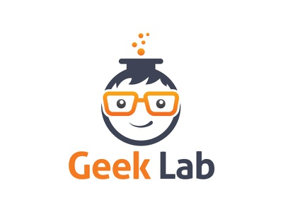

[![Contributors][contributors-shield]][contributors-url]
[![Forks][forks-shield]][forks-url]
[![Stargazers][stars-shield]][stars-url]
[![Issues][issues-shield]][issues-url]
[![MIT License][license-shield]][license-url]

<!-- PROJECT LOGO -->
<br />
<p align="center">
  <a href="https://github.com/caiolucena/geeklab">
    
  </a>
  <h2 align="center">GeekLab - Study Repository</h2>
</p>

<!-- TABLE OF CONTENTS -->

## Table of Contents

- [About the Project](#about-the-project)
  - [Built With](#built-with)
    - [IDEs](#IDEs)
    - [Program Languages](#program-languages)
- [Summary](#summary)
- [Getting Started](#getting-started)
  - [Prerequisites](#prerequisites)
  - [Installation](#installation)
- [Roadmap](#roadmap)
- [Contributing](#contributing)
- [License](#license)
- [Contact](#contact)

<!-- ABOUT THE PROJECT -->

## About The Project

This is the study repository, which contains all implementations, slides and other resources used by the Accenture Geeklab study group.

### Built With

#### IDEs

- [Eclipse](https://www.eclipse.org/downloads/)
- [Visual Studio Code](https://code.visualstudio.com/)

#### Program Languages

- [Java](https://www.oracle.com/technetwork/pt/java/javase/downloads/index.html)
- [NodeJS](https://nodejs.org)

## Summary

Here is a summary of all codes for each study topic:

- [Project Pattern](https://github.com/caiolucena/geeklab/tree/master/project-pattern)
  - [01 - Factory](https://github.com/caiolucena/geeklab/tree/master/project-pattern/01-FactoryLab)
  - [02 - Singleton](https://github.com/caiolucena/geeklab/tree/master/project-pattern/02-Singleton)
  - [03 - Observer](https://github.com/caiolucena/geeklab/tree/master/project-pattern/03-Observer)
  - [04 - Creator](https://github.com/caiolucena/geeklab/tree/master/project-pattern/04-Creator)
  - [05 - Facade](https://github.com/caiolucena/geeklab/tree/master/project-pattern/05-Facade)
  - [06 - State](https://github.com/caiolucena/geeklab/tree/master/project-pattern/06-State)
  - [08 - Memento](https://github.com/caiolucena/geeklab/tree/master/project-pattern/08-Memento)
  - [09 - Adapter](https://github.com/caiolucena/geeklab/tree/master/project-pattern/09-Adapter)

<!-- GETTING STARTED -->

## Getting Started

To execute the created codes, just read the installation process in README.md for each implementation.

### Installation

1. Clone the geeklab

```sh
git clone https://github.com/caiolucena/geeklab.git
```

2. Open the project directory through your preferred IDE. We recommend using Visual Studio Code to execute Javascript / Typescript code and Eclipse to execute Java code. If in doubt, read the individual `README` for each project to learn how to run it.

3. Run the code and enjoy it :).

<!-- ROADMAP -->

## Roadmap

See the [open issues](https://github.com/caiolucena/geeklab/issues) for a list of proposed features (and known issues).

<!-- CONTRIBUTING -->

## Contributing

Contributions are what make the open source community such an amazing place to be learn, inspire, and create. Any contributions you make are **greatly appreciated**.

1. Fork the Project
2. Create your Feature Branch (`git checkout -b feature/AmazingFeature`)
3. Commit your Changes (`git commit -m 'Add some AmazingFeature'`)
4. Push to the Branch (`git push origin feature/AmazingFeature`)
5. Open a Pull Request

<!-- LICENSE -->

## License

Distributed under the APACHE License. See `LICENSE` for more information.

<!-- CONTACT -->

## Contact

- **Caio Lucena** - _Initial Work_. </br></br>
  [](https://twitter.com/caioblucena)
  [](https://www.facebook.com/caio.lucenaa)
  [](https://www.linkedin.com/in/caio-cesar-b-lucena/)
  [](https://github.com/caiolucena/) [](https://www.instagram.com/caioluucena/) </br></br>

- **Lucas Rocha** - _Initial Work_. </br></br>
  [](https://twitter.com/lucasrochacc)
  [](https://www.facebook.com/lucasrochacc)
  [](https://www.linkedin.com/in/lucasrochacc/)
  [](https://github.com/lucasrochagit/)
  [](https://www.instagram.com/lucasrochacc/) </br></br>

- **Luis Lancelote** - _Initial Work_. </br></br>
  [](https://www.linkedin.com/in/luis-lancellote-marques-74552619a/)
  [](https://github.com/LanceMarques/)
  [](https://www.instagram.com/lance_marques/) </br></br>

- **Adalcino Junior** - _Initial Work_. </br></br>
  [](https://www.linkedin.com/in/adalcino-junior-863829192/)
  [](https://github.com/adalcinojunior)
  [](https://www.facebook.com/adalcino.junior.96) </br></br>

<!-- ACKNOWLEDGEMENTS -->

<!-- MARKDOWN LINKS & IMAGES -->
<!-- https://www.markdownguide.org/basic-syntax/#reference-style-links -->

[contributors-shield]: https://img.shields.io/github/contributors/caiolucena/geeklab.svg?style=flat-square
[contributors-url]: https://github.com/caiolucena/geeklab/graphs/contributors
[forks-shield]: https://img.shields.io/github/forks/caiolucena/geeklab.svg?style=flat-square
[forks-url]: https://github.com/caiolucena/geeklab/network/members
[stars-shield]: https://img.shields.io/github/stars/caiolucena/geeklab.svg?style=flat-square
[stars-url]: https://github.com/caiolucena/geeklab/stargazers
[issues-shield]: https://img.shields.io/github/issues/caiolucena/geeklab.svg?style=flat-square
[issues-url]: https://github.com/caiolucena/geeklab/issues
[license-shield]: https://img.shields.io/github/license/caiolucena/geeklab.svg?style=flat-square
[license-url]: https://github.com/caiolucena/geeklab/blob/master/LICENSE
[product-screenshot]: images/screenshot.png
